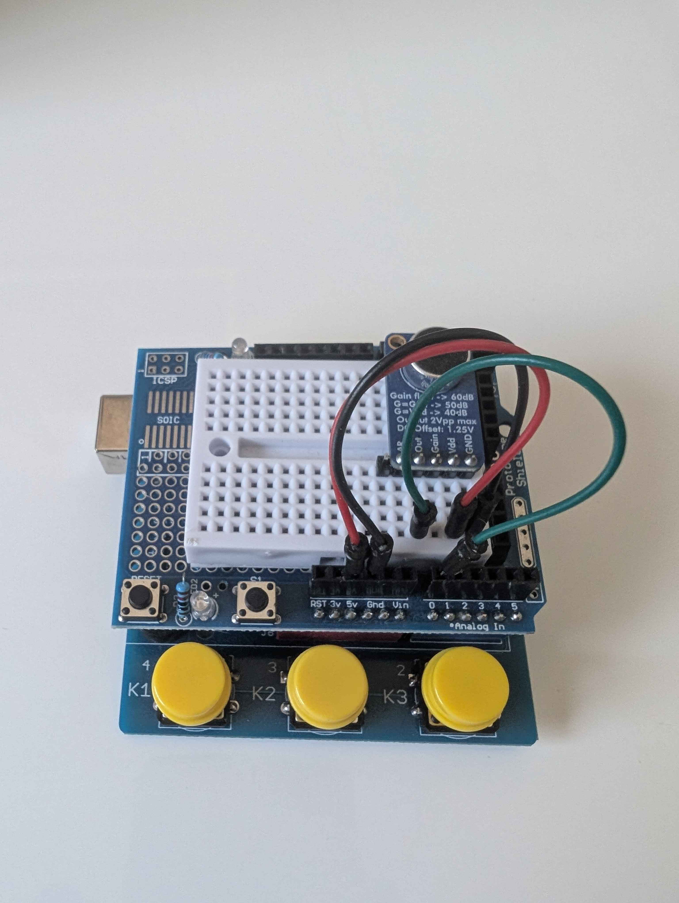

# Instrument Pitch Tuner

Arduino sketch that reads an analog microphone, runs an FFT, and prints the detected musical note, octave, and cents deviation over Serial.

Extracted from the [Trumpet Pitch Tuner](https://github.com/LD07P/Trumpet-Pitch-Tuner) project as a standalone note-reading firmware.



## Features

- Real-time pitch detection via FFT (`arduinoFFT`)
- Note name and octave (A4 reference at 440 Hz)
- Cents deviation (positive = sharp, negative = flat)
- Noise gate and consistency filtering to reduce false readings

## Hardware

| Component | Arduino Pin |
|-----------|-------------|
| Microphone signal | A0 |
| Microphone VCC | 5V |
| Microphone GND | GND |

- **Board**: Arduino Uno (or compatible)
- **Mic**: Analog microphone module with a built-in amplifier and ~1.25 V DC bias (centered around mid-scale for `analogRead`). This project used a [MAX9814](https://www.adafruit.com/product/1713) electret microphone amplifier module. The microphone **must** include an amplifier to work with this sketch; otherwise a custom amp must be built and integrated.

## Software

- [PlatformIO](https://docs.platformio.org/) (recommended) or Arduino IDE
- [arduinoFFT](https://github.com/kosme/arduinoFFT) v2.0.4+

## Build and upload (PlatformIO)

```bash
git clone https://github.com/LD07P/Instrument-Pitch-Tuner.git
cd Instrument-Pitch-Tuner
pio run --target upload
```

You can also build and upload from the PlatformIO sidebar or bottom bar in VS Code (or Cursor) instead of the CLI.

Open the Serial Monitor at **9600** baud, play or sing into the mic, and you should see lines like:

```
A4 +5
C5 -12
Eb4 +2
```

### Arduino IDE

1. Install **arduinoFFT** by kosme (Library Manager, v2.0.4+)
2. Copy `src/main.cpp` into a `.ino` sketch
3. Select Arduino board and your port, then Upload

## Configuration

In `src/main.cpp` you can adjust:
- `rfreq`: Reference frequency for A4 (default: 440.0 Hz)
- `requiredConsistentReads` Required note consistency to display
- `freqTolerance` Allowed Hz difference to be considered the same note
- `noiseAmplitudeThreshold` Determines nessecary amplitude to read
- `samples`: Number of FFT samples (must be power of 2, scales with more SRAM, default: 128)
- `FFT.windowing`: FFT window (`FFTWindow::Hamming` or `FFTWindow::Hann`, default: Hamming)
- `delay()`: Serial monitor update rate in milliseconds (default: 300ms)

## License

MIT — see [LICENSE](LICENSE).
